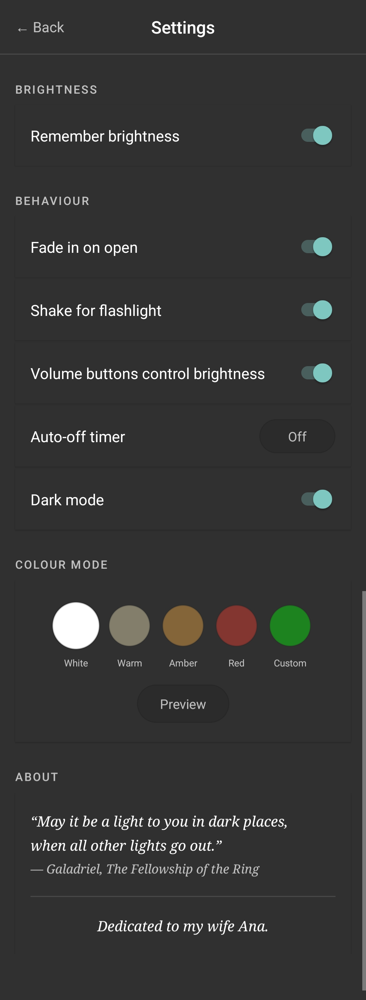

# Phial

<p align="center">
  
</p>

<p align="center">
  A screen torch for Android that works from the lock screen, with no ads or tracking.
</p>

---

*"May it be a light to you in dark places, when all other lights go out."*
*— Galadriel, The Fellowship of the Ring*

*Dedicated to my wife Ana.*

---

## What it does

Phial turns your screen into a bright light source. Open it from the lock screen and your phone wakes up and lights up immediately — no unlocking required. Close it and it disappears from recent apps without a trace.

## Features

- **Lock screen** — wakes the screen and shows over the lock screen without unlocking
- **Brightness control** — slider adjusts brightness in real time; volume buttons work too
- **Fade in** — smooth brightness transition when the app opens
- **Colour modes** — White, Warm, Amber, Red, and a fully custom colour picker
- **Camera flashlight** — shake to switch to the LED torch, with brightness control on supported devices; shake again to return
- **Auto-off timer** — closes automatically after 1, 2, 5, or 10 minutes
- **No recent apps entry** — disappears from the app switcher when closed
- **Dark mode** — settings screen follows the system theme
- **No ads, no tracking, no internet access**

## Screenshots

<p align="center">
  
</p>

## Requirements

- Android 6.0 (API 23) or higher

## Install

[](https://f-droid.org/packages/com.phial.app)

Or download the APK from the [Releases](https://github.com/vdb86/phial/releases) page.

## Building from source

### Prerequisites

- Android Studio Hedgehog or newer
- Android SDK with API level 34

### Steps

```bash
git clone https://github.com/vdb86/phial.git
cd Phial
./gradlew assembleDebug
```

The debug APK will be at `app/build/outputs/apk/debug/app-debug.apk`.

### Release build

Use **Build → Generate Signed Bundle / APK** in Android Studio and sign with your keystore.

### Dependencies

| Library | License |
|---|---|
| AndroidX AppCompat | Apache-2.0 |
| AndroidX ConstraintLayout | Apache-2.0 |
| AndroidX Core KTX | Apache-2.0 |
| ColorPickerView (skydoves) | Apache-2.0 |

## Permissions

| Permission | Reason |
|---|---|
| `CAMERA` | LED flashlight control |
| `WAKE_LOCK` | Keep screen on while torch is active |
| `DISABLE_KEYGUARD` | Show over the lock screen |

## Privacy

Phial processes everything locally on your device. No data is sent anywhere. No analytics. No tracking. No internet permission.

## License

[GPL-3.0](LICENSE)

## Contributing

Issues and pull requests are welcome. Please open an issue before submitting a large change.