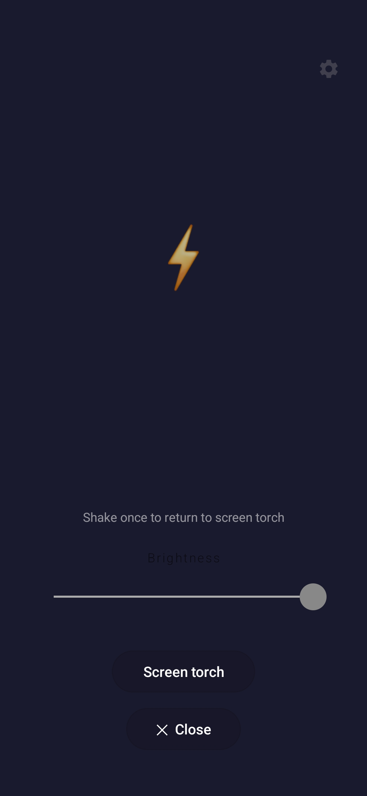
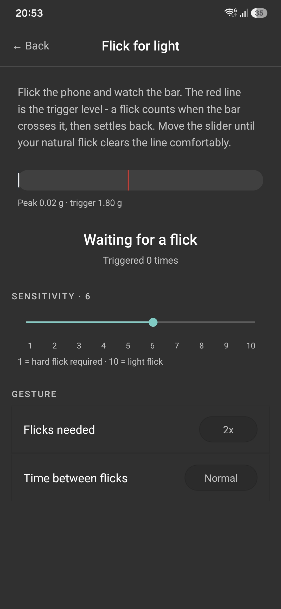
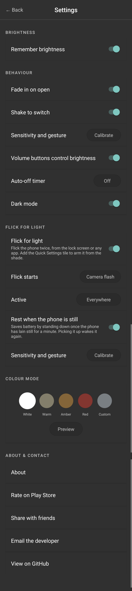

# Phial

  

  A screen torch for Android that works from the lock screen, with no ads or tracking.

  

---

*"May it be a light to you in dark places, when all other lights go out."*
*- Galadriel, The Fellowship of the Ring*

*Dedicated to my wife Ana.*

---

## 💬 Feedback, bug reports & feature requests

Found a bug or have an idea? This is the place to let me know.

- 🐞 **Found a bug?** [Report a bug](../../issues/new?template=bug_report.yml) and tell us what happened, what you expected, and your device / Android version.
- 💡 **Have an idea?** [Request a feature](../../issues/new?template=feature_request.yml) - I read every suggestion.
- 👍 **Want something that's already been suggested?** Browse [bug reports](../../issues?q=is%3Aissue+label%3Abug) and [feature requests](../../issues?q=is%3Aissue+label%3Aenhancement) and add a 👍 or a comment so I know it matters to you.

Please search the [open issues](../../issues) first to avoid duplicates.

---

## What it does

Phial turns your screen into a bright light source. Open it from the lock screen - or just flick your phone twice - and it lights up immediately, no unlocking required. Close it and it disappears from recent apps without a trace.

## Features

- **Flick for light** - flick the phone twice to light up from the lock screen, any app, or with the screen off; choose whether a flick starts the screen torch or the camera flash
- **Quick Settings tile** - arm and disarm the flick watcher from the shade; pause and resume it from its notification
- **Battery aware** - the watcher rests while the phone lies still and wakes the moment it is picked up
- **Calibration** - a live meter to tune sensitivity, movement count and timing, separately for the flick and the shake
- **Lock screen** - wakes the screen and shows over the lock screen without unlocking
- **Brightness control** - slider adjusts brightness in real time; volume buttons work too
- **Fade in** - smooth brightness transition when the app opens
- **Colour modes** - White, Warm, Amber, Red, and a fully custom colour picker
- **Camera flashlight** - shake or tap the mode button to switch to the LED torch, with brightness control on supported devices; shake or tap again to return
- **Auto-off timer** - closes automatically after 1, 2, 5, or 10 minutes
- **No recent apps entry** - disappears from the app switcher when closed
- **Dark mode** - settings screen follows the system theme
- **No ads, no tracking, no internet access**

## Screenshots

  
  
  
  

## Requirements

- Android 6.0 (API 23) or higher
